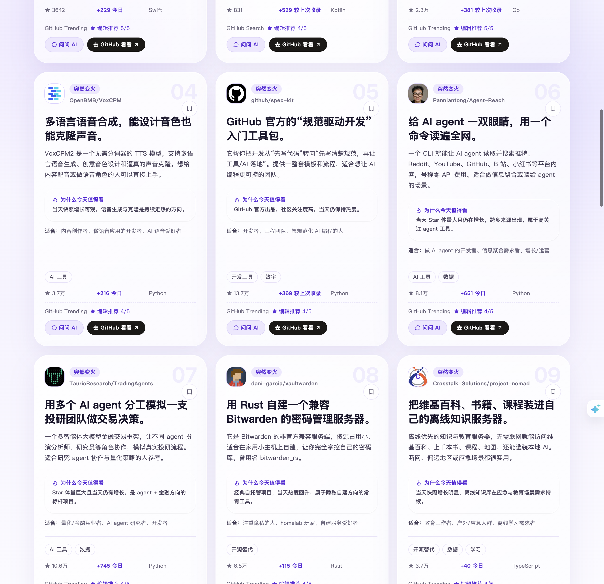

<div align="center">


# GitHub 今日好玩

**每天 3–5 分钟，读完今天最好玩的开源项目 —— 全中文、AI 精编、普通人也看得懂。**

[](https://github.com/seiyachan-desuyo/github-todays-fun/stargazers)
[](https://github.com/seiyachan-desuyo/github-todays-fun/network/members)
[](LICENSE)
[](https://nextjs.org/)
[](app.json)

### [🚀 立即在线体验](https://1384e82de8f4.ida-app.bytedance.net)

<br />


</div>

---

## ✨ 这是什么

**GitHub 今日好玩** 是一份「每日开源小杂志」：程序每天从 GitHub 官方数据里采集当天热门 / 有趣的项目，AI 编辑筛成 **30 个精选**，并配上一句"这是干嘛的"、"怎么玩"、"为什么今天值得看"和"适合谁"，全部用中文写好。

不用刷 Trending、不用啃英文 README —— 打开就能像翻杂志一样看完。

> 面向**普通用户、AI 爱好者、轻度开发者**；每期固定 30 个精选 + 100+ 完整候选池，阅读时长目标 3–5 分钟。

<div align="center">

<br />
<sub>每张卡片都有通俗介绍、推荐理由、适合人群、真实 Star 增长与来源标记</sub>
</div>

## 🎯 核心特性

| 特性 | 说明 |
| --- | --- |
| 🗞️ **每日精选** | 每天 30 个精选项目，AI 编辑成中文推荐，翻完只要 3–5 分钟 |
| 🧠 **AI 编辑，事实不编造** | 程序只采集真实事实（Star、增长、来源、语言等），AI 只做选题和写介绍，不从项目名猜功能 |
| 🔍 **多维筛选** | 按「新鲜 / 变火 / AI / 实用 / 脑洞」标签快速定位，支持关键词搜索项目、用途、标签 |
| 📈 **真实增长信号** | 展示 GitHub Trending 的 `stars today` 与本地快照跨日 Star 增量，两种口径分开标记 |
| 🗂️ **完整候选池** | 精选之外还保留当天 100+ 完整候选池，想深挖可展开"查看更多候选" |
| 🌙 **舒适阅读体验** | 杂志式排版、明暗主题、收藏与兴趣本地保存，无需登录 |
| 🤖 **也是一个 Aime App** | 内置应用首页、`github-today-fun` Skill 与 `/github-today` 命令 |

## 🚀 在线体验

> ### 👉 [https://1384e82de8f4.ida-app.bytedance.net](https://1384e82de8f4.ida-app.bytedance.net)

或在 Aime 里安装本应用，直接用命令获取当日精选：

```text
/github-today [latest|YYYY-MM-DD] [1-10]
```

## 🏗️ 项目架构

项目把「**事实采集**」和「**编辑判断**」彻底分开，保证内容真实、前端零模型依赖：

```text
GitHub 官方数据源                 程序化采集              AI 编辑              静态站点
─────────────────      →      ──────────────    →    ──────────    →    ─────────────
Search API / Trending          去重·增长计算            Aime 选题           Next.js 静态导出
Repository API                 可解释评分              写中文介绍          纯读校验后的 edition
                               snapshot + task        30 项精选           前端不调用任何模型
```

- **事实由程序采集**：仓库信息、Stars、增长与来源、语言、topics、评分信号全部写入结构化任务。
- **内容由 Aime 编辑**：只依据真实事实选题、写介绍，缺少编辑结果时校验直接失败，绝不悄悄灌模板。
- **前端不调用模型**：Next.js 页面只读取校验通过的静态刊物，部署无需任何模型密钥。

```text
app.json                        Aime App 清单
runtime/                        Aime App 静态站点服务
skills/github-today-fun/        Aime Skill
commands/github_today.py        /github-today 命令
scripts/collect-editor-task.ts  事实采集，生成 snapshot + editor task
scripts/validate-edition.ts     校验正式刊与事实一致
src/data/editions/              AI 编辑完成的静态刊物
src/lib/pipeline/               规范化、去重、快照与评分
```

更多细节见 [`docs/aime-app.md`](docs/aime-app.md)、[`docs/daily-publishing.md`](docs/daily-publishing.md) 与 [`docs/lark-daily-bot.md`](docs/lark-daily-bot.md)。

## 💻 本地运行

需要 Node.js >= 20 与 pnpm。

```bash
# 1. 安装依赖
pnpm install

# 2. 启动开发服务器
pnpm dev
# 打开 http://localhost:3000

# 3. 采集当天真实候选（生成 snapshot + editor task，不生成正式刊）
pnpm collect

# 4. 校验、构建（静态产物输出到 dist/）
pnpm validate:edition
pnpm build
```

环境变量复制 `.env.example` 为 `.env.local` 即可，默认流程**不需要任何 LLM Key**；`GITHUB_TOKEN` 可选，建议生产配置以提高 API 限额。

### 自部署

项目使用 Next.js 静态导出，`pnpm build` 后把 `dist/` 整体部署到任意静态托管即可。需要每日自动出版或飞书 Bot 推送时，分别参考 `docs/daily-publishing.md` 和 `docs/lark-daily-bot.md`。

## 🤝 参与贡献

欢迎 Issue / PR，一起把这份小杂志做得更好玩：

- 🐛 提 Bug、建议新标签或数据源 → [提交 Issue](https://github.com/seiyachan-desuyo/github-todays-fun/issues)
- 📖 贡献指南：[CONTRIBUTING.md](CONTRIBUTING.md) ｜ 安全报告：[SECURITY.md](SECURITY.md)
- 📜 开源许可：[MIT](LICENSE)

## ⭐ 支持一下

如果这份「今日好玩」帮你省下了刷 GitHub 的时间，或者让你发现了一个有意思的项目，

**点个 Star 🌟 就是对日更最大的鼓励！**

<div align="center">

[](https://star-history.com/#seiyachan-desuyo/github-todays-fun&Date)

<br />

**[⬆ 回到顶部](#github-今日好玩)** ｜ Made with 🌟 & [Aime](app.json)

</div>
